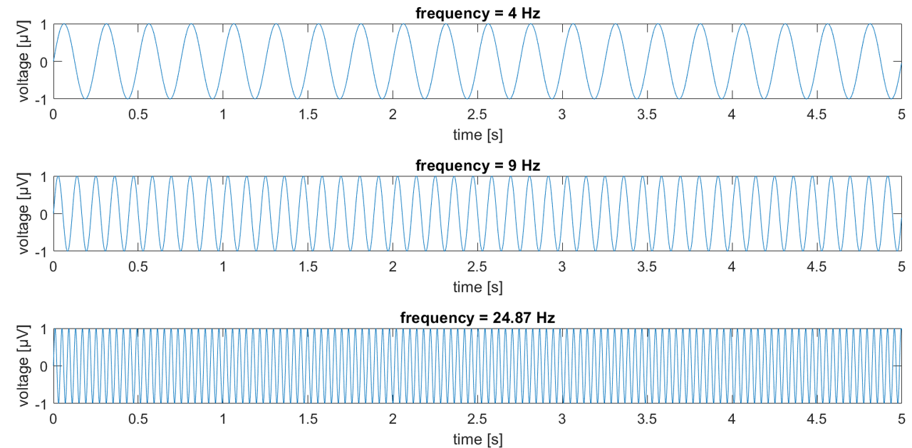

## Psychophysiology of Sport and Exercise
# Biosignals
 

Germano Gallicchio

JXH-3089, Bangor University

<!-- this is a note -->

---
title: objectives and content
layout: two-cols
hideInToc: true
---

## Objectives 
 

Being able to elaborate:
- sources and propagation of biosignals
- acquisition of biosignals 
- processing of biosignals

::right::

## Content
 
<Toc text-sm minDepth="1" maxDepth="3" columns="2"/>
---
layout: intro
title: sources and propagation
level: 1
---

# Biosignals: 

## sources and propagation

---
title: ripple analogy
layout: two-cols-header
level: 2
---

## Ripple analogy

::left::

Throwing a stone in a pond

>[Biosignals] are complex ramifications of the [electrochemical] spread of action [and graded] potentials in a conductive medium, the human body.

(Adapted from Stern et al. 2001 [^1])

[1]: Stern, R. M., Ray, W. J., & Quigley, K. S. (2001). Psychophysiological recording. Oxford University Press, USA.

::right::

| ANALOGY | MEANING |
| ------: | --- |
| stone   | electrochemical event |
| water   | medium for propagation |
| ripple  | electrical field |

---
title: basic principles of propagation
level: 2
---

## Some basic principles of biosignals propagation:

 

---
title: volume conduction
level: 3
---

## Volume conduction

- Electrical fields spread in space instantly 
(electromagnetic waves travel at the speed of light)
- Propagation medium: extracellular fluid
- Volume conduction is **good**: it allows to detect the phenomenon at a distance
- Volume conduction is **bad**: multiple sources get mixed

---
title: impedance
level: 3

---
## Impedance

- Resistance to propagation of the electrical field
- Mainly due to the outer layer of the skin
- It can be decreased through (mild) skin abrasion

---
title: spatial degradation
level: 3
---

## Spatial degradation

- The electrical field is stronger near its source
- Its magnitude diminishes gradually the farther from the source

---
title: summation
level: 3
---

## Summation

- Most electro-chemical events are very small and involve few cells
- Because of their small magnitude and of spatial degradation, _in principle_ we cannot detect them from the skin
- However... small electro-chemical potentials can _summate_ into a larger potential when the individual potentials occur:
    - at the same time
    - in the same area
    - with roughly the same orientation (more on this in the next slide)

---
layout: two-cols
title: orientation
level: 3
---

## Orientation

- Each electrical event has a geometry: a dipole
- Just like vectors, multiple dipoles have a _resultant_
- Dipoles in the same orientation _summate_ and their resultant is larger than the individual dipoles
- Dipoles in the opposite orientation _cancel out_ and their resultant is smaller than the individual dipoles (or even null)
- Not all resulting dipoles are big enough to be detectable from the skin

::right::

---
layout: intro
title: acquisition
level: 1
---

# Biosignals: 
## acquisition

---
title: the recording chain
level: 2
---

## Overarching objective:
- Measure the electrical field associated with the biological event (the **signal**)
- While discarding as much as possible of other biological (or not biological) events (the **noise**)
- makimize signal to noise ratio: 
  $SNR = \frac{S}{N}$

## The recording chain:

---
title: Sensors (electrodes)
level: 3
---

## Sensors: Electrodes

Conductive material

Used in pairs to measure a _difference_ in voltage
Note: One electrode alone cannot measure anything

At the interface between electrode and skin, electro-chemical reactions occur consisting of exchange of ions. 

The exchange of ion generates an unwanted voltage, called **offset potential** or bias potential

Desirable property of electrodes: **stability** against offset potential

Factors affecting electrode stability:
- temperature
- electrolyte composition (between the electrode and the skin)
- metal type (the electrode)

---
title: Sensors (electrodes)
level: 3
---

Lykken (1959)[^1] experimented with different metals.

Left pairs of electrode pairs of various metals in a saline solution (electrolyte) for 1 hour.

Among several metals such as platinum, zinc, silver, **Ag/AgCl**[^2] showed the lowest offset potential. To this day, mosty electrodes are made of this metal.

[^1]: [Lykken, D. T. (1959). Properties of electrode used in electrodermal measurement. Journal of Comparative and Physiological Psychology, 52(5), 629.](https://psycnet.apa.org/doi/10.1037/h0047437)
[^2]: Ag/AgCl = "chlorided silver" or "silver / silver chloride" meaning silver coated with silver chloride

---
title: Sensors (electrodes)
level: 3
---

Desirable property of skin-electrode interface **low impedance**, so the signal passes through with little resistance.
skin --> electrolytic gel --> electrode

Skin preparation to lower impedance:
- mild abrasion with sandpaper or abrasive paste (scrub) to remove dead cells
- alcohol to clean residuals 
- More abrasion --> lower impedance
- Larger signals (e.g., ECG) can be ok even with less abrasion

---
title: Sensors (electrodes)
level: 3
---

## electrode types

  
  
  

1. pregelled
2. requires gel and cleaning (requires care)
3. like n.2 but with pre-amplifier (requires extra care)

---
title: Sensors (transducers)
level: 3
---

## Sensors: Transducers

While biological events have electrical nature, certain electrical fields are difficult to detect. Non-electrical consequences of these events are easier to detect

Transducers convert (_transduce_) non-electrical signals to electrical signals (for the next steps of the recording chain)

---
title: Sensors (transducers)
layout: two-cols-header
level: 3
---
Examples:

::left::

## changes in blood volume

Photo-conductive transducer:
- infra-red (IR) light is sent from a light emitter
- IR-light passes through certain biological tissues (e.g., skin) but it is reflected back by other tissues (e.g., blood)
- By measuring the difference between IR-light emitted and received back, we can infer blood volume
- commonly placed on finger or earlobe

::right::

## changes in pupil diameter

Photo-sensitive transducer:

- infra-red (IR) light is sent from a light emitter
- IR-light is reflected differently by pupil and iris 
- By measuring the areas with more and less IR-light reflection, we can infer the size of the diameter
- pupillometry

---
title: coupler
level: 3
---

##  Coupler

 

Transmits the electrical signal from the sensor to the amplifier.

Optionally:
- it powers the transducer
- basic computations (e.g., filtering)

---
title: coupler
level: 3
---

Filtering is a complex mechanism... Let's first see waveforms of different frequencies

---
title: coupler
level: 3
---

basic filter types

## Low-pass
Filters out fast (high) frequencies and retains slow (low) frequencies

## High-pass
Filters out slow (low) frequencies and retains fast (high) frequencies

Both filters require:
- cut-off frequency value
- other parameters having to do with how sharp the transition is from filtered frequencies to non-filtered frequencies

---
title: coupler
level: 3
---

## Band-pass 
a combination of high-pass and low-pass filters to allow frequencies between two cut-off values, which describe a _frequency band_. Frequecies outside of this band are filtered out

Depending on the sharpness parameter, frequencies near the transition are partly retained

In theory, a filter with a sharp transition is better. In practice, too sharp will create distortions

## Notch

Filters out only one frequency (and those immediately near t) 
Used to minimize the electrical interference from mains electricity (alternative current). In the UK, it is 50 Hz

---
title: amplifier
level: 3
---

## Amplifier

 

Multiplies the filtered signal

The multiplication factor is called **gain**

Traditionally, so the magnitude of the signal reaches approximately 1 V. 

For example, a signal with magnitude 1 mV will be multiplied by 1000 to reach 1 V. In this example, the gain is 1000.

Note: Important to amplify the noise but not the signal. That's why filtering happens before amplifying (with some exceptions)

---
level: 2
title: visualization and storage
---
## Visualization and storage

### Analog signal
- continuous. 
- Imagine an uninterrupted line on a polygraph.

### Digital signal
- discrete. 
- Ir has small temporal gaps between each value. Imagine taking a a _sample_ (value) every so often and storing each sample. If the samples are taken very often, the gaps between samples will be small.

**Sampling rate**: how many samples are taken in a unit of time

---
level: 2
title: sampling
---

## Analog-to-digital conversion

Computers can only store digital signals. But the acquired electrical signals are analog

The computer samples the analog signal at a certain rate to store a digital copy.

The digital copy of the analog signal is an approximation of the original analog signal

---
level: 2
title: sampling
---

The higher the sampling rate, the better the digital copy. However, higher sampling rate needs more digital storage/memory.

The lower the sampling rate the less digital  storage/memory is required. However, too low sampling rate leads to distortion.

Analogy for the analog-to-digital conversion: Imagine you want to convert a 1-min video into a number of screenshots that can decently represent what's in the video. How often do you take a screenshot? 
It depends on what's in the video...

---
level: 2
title: sampling
---

Distortion due to using a too-small sampling rate is called **aliasing**

To avoid aliasing, the sampling rate should be at least 2-5 times larger than the larger frequency contained in the signal.

---
layout: intro
title: processing
level: 1
---

# Biosignals: 

## processing

---
level: 2
---

## Signal reduction
Term indicating the _signal processing_ happening before statistics are run. For example:
- _reduce_ the complex ECG waveform into a simpler series of heart rate (HR) values
- _reduce_ the complex EOG waveform into a simpler number of eye blinks within a minute

Signal reduction can happen 
- _online_ (during the acquisition stage, in real time) 
- _offline_ (after the acquisition stage)

---
level: 2
---

## signal processing

The temporaldynamics of biological activity can be classified in:
- tonic
- phasic

---
level: 2
---

## tonic activity

- Background level over a relatively _long_ period of time
- Useful for studying the signal "on average" 
- Generally recorded at rest, but it could be recorded during a relatively long activity
- Sometimes interesting as a baseline for phasic acitivyt (next slide); sometimes interesting by itself (e.g., essential hypertension)

---
level: 2
---

## phasic activity

- Transient activity over a relatively _short_ period of time
- Useful for studying the short-lived fluctuations on top of tonic activity
- Generally specific to reaction to certain events (e.g., a stimulus is presented that needs processing, an action is performed)
- It can be a change in amplitude of the signal, frequency of the signal, or other (more complex) parameters not discussed in this module

---
level: 2
---

## Change scores

General idea: describe transient changes (phasic activity) from baseline (tonic activity)

A = activity; &nbsp;&nbsp;&nbsp;&nbsp;&nbsp;&nbsp;&nbsp;&nbsp;&nbsp;&nbsp;&nbsp; B = baseline

Notable types of change scores:
* subtraction: $A-B$
* percentage change: $\frac{A-B}{B}\\ *100$
* decibel change: $10log_{10}\frac{A}{B}\\$

---
layout: two-cols
level: 2
---

## time domain
Features that develop over time. For example:
- durations (e.g., eye blink duration)
- rate (e.g., number of ECG R-waves in 1 minute)
- amplitude (e.g., max blood pressure)

## frequency domain (aka: spectral) 
Features linked to trends. For example:
- the magnitude of oscillations at certain frequencies
- the positioning of oscillations at certain frequencies

::right::

## coherence
Extent to which two signals are related
- within the same biological domain (e.g., connectivity between brain areas)
- across biological domains (e.g., coupling between breathing rate and heart rate)

---
title: More to come
level: 2
hideInToc: true
---

Caveats with the acquisition and processing of each specific biological signals of psychological interest. In this module, we will focus on:
- electrooculogram (EOG)
- electrocardiogram (ECG)
- electroencephalogram (EEG)
