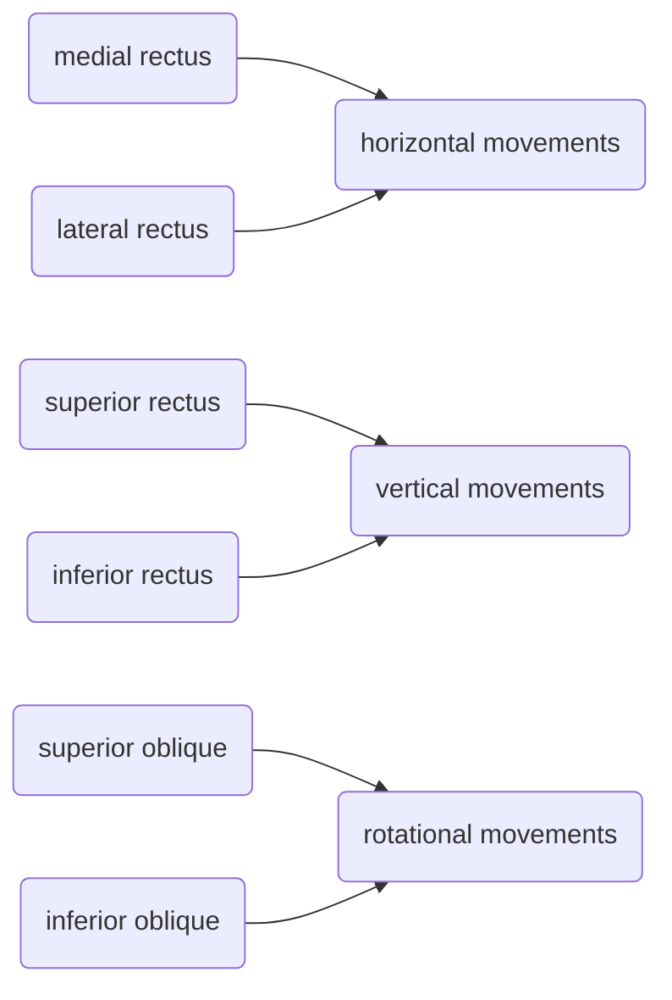
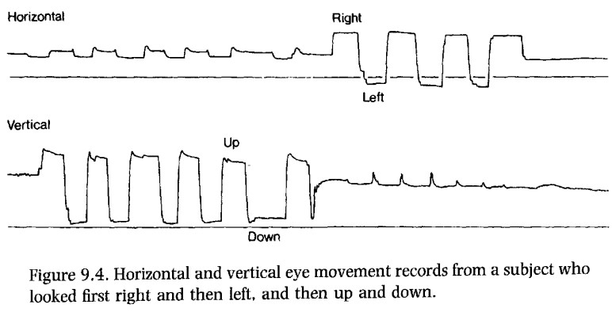
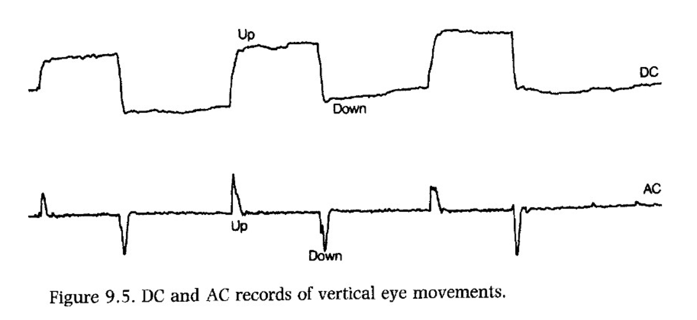
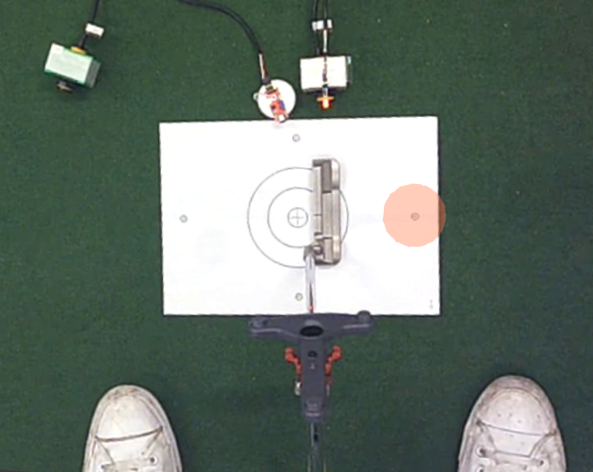
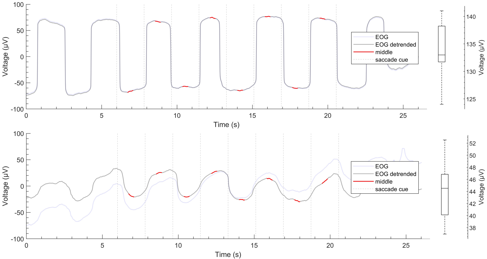
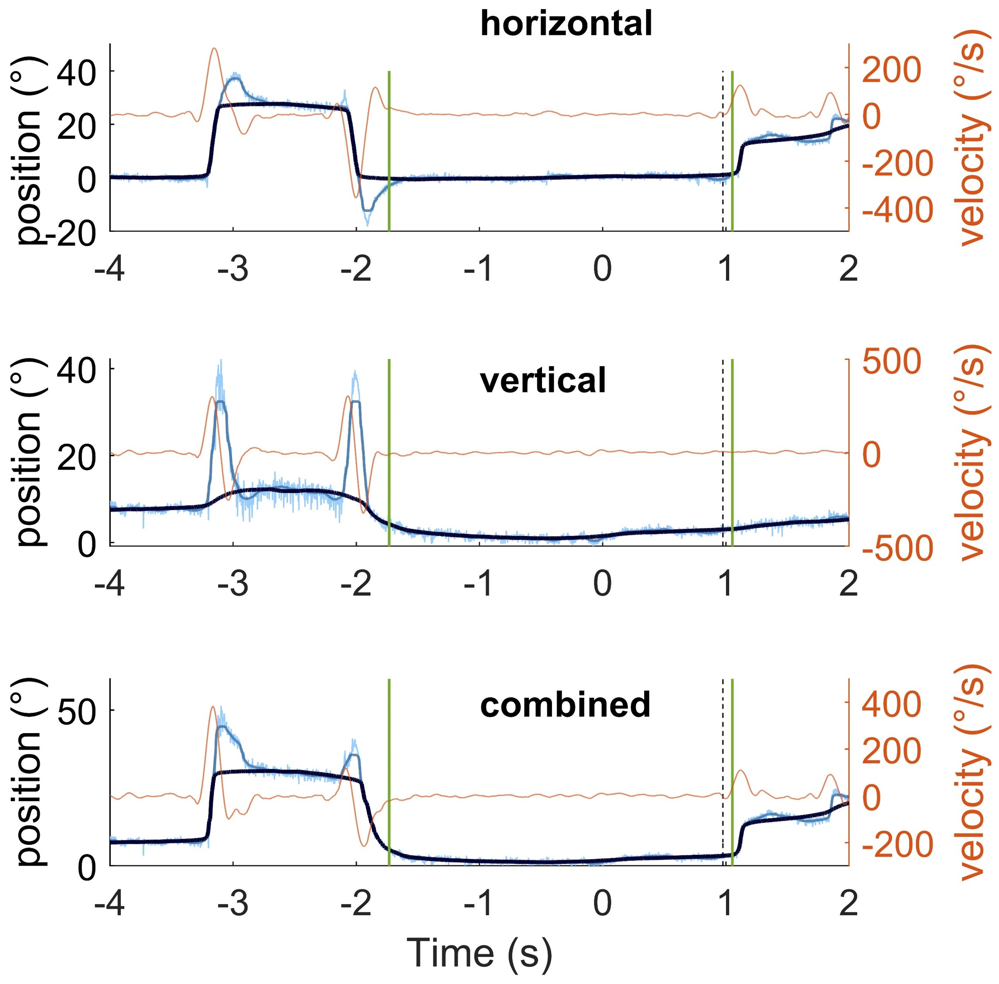

### Psychophysiology of Sport and Exercise
# Oculomotor psychophysiology
 

Germano Gallicchio

JXH-3089, Bangor University

---
layout: center
---

Attendance PIN

---
layout: two-cols
hideInToc: true
---

# Objectives 

 

Being able to elaborate:

<v-clicks>

- biological source of the EOG signal
- metrics that can be obtained from the EOG signal

</v-clicks>

::right::

# Content
 
<Toc text-sm minDepth="1" maxDepth="3" columns="2"/>

---
layout: two-cols-header
---

# Study resources

::left::

## Main
Stern, R. M., Ray, W. J., & Quigley, K. S. (2001). Psychophysiological recording. Oxford University Press, USA.

 

Other resources (e.g., articles published in the journal _Psychophysiology_) are cited when relevant.

::right::

---

# Why study eye movements
 

Studying eye movements is useful for several purposes:

<v-clicks>

- **Research**: Studying the relationship between eye movements and cognitive processes, such as attention and memory at rest or while performing certain activities (e.g., reading, computer work, consumer behaviour)
- **Sleep**: Monitoring eye movements during different sleep stages, particularly REM sleep.
- **Human-computer interface**: Developing eye-tracking systems for controlling computers and other devices (e.g., wheelchair, speller).
- **Fatigue and sleepiness monitoring**: In fields like transportation or aviation, EOG can help monitor alertness by detecting patterns associated with drowsiness.
- **Sport**: Analyzing athletes' eye movements to improve performance and training techniques.

</v-clicks>

---
layout: two-cols-header
---

# Muscular control of the eyes
 

::left::

Six muscles attached to the outer surface of each eye

{width=100%}

In practice, all muscles contribute to all movements

Impractical to record

::right::

---

# Types of eye movements
 

<v-clicks>

- Saccades 
- Nystagmus
- Smooth movements
- Fixational movements
 
</v-clicks>

---

## Saccades
 

- Quick jumps from one fixation point to another
- They allow to _foveate_ objects or locations
  - foveate = direct the eyes so that image of interest in reflected in the part of the retina with most photoreceptors called fovea
- One of the fastest human movements, with angular speed  up to 700°/s

---

## Fixational movements
 

>Far from being a quiet interlude between eye movements, fixation is a lively period of continuous albeit microscopic motion, full of complex interactions that we are just beginning to understand.  
Krauzlis et al. (2017)[^1]

mostly involuntary

main function: avoiding retinal image fading

several types:
- Microsaccades (tiny jerky movements)
- Drift (slow wandering movements)
- Tremor (rapid oscillations)

[^1]: Krauzlis, R. J., Goffart, L., & Hafed, Z. M. (2017). Neuronal control of fixation and fixational eye movements. _Philosophical Transactions of the Royal Society B: Biological Sciences, 372_(1718), 20160205. 
---

## Smooth movements

Slow movements of the eyes to allow fixation under moving conditions

Two types:

<v-clicks>

- **smooth pursuit movements** The eyes track a moving object through slow conjugate movements. The head might be still.

Try... you can't without anything to track

- **smooth compensatory movements** The eyes fixate on a still object but the head and/or the body move

Try... pick a point and move your head

</v-clicks>

---

## Nystagmus

- Rhythmic movements
- from Greek "drowsy"

Two types:
- clinical
- non-clinical
  - _vestibular_: compensations for rhythmic head movements
  - _optokinetic_: watching a moving pattern (e.g., a train passing by)

 
<Youtube id="LInm9cZcHyk" width="100%" height="20%"/>

https://www.youtube.com/watch?v=LInm9cZcHyk

---
layout: two-cols-header
---

# The eye as a dipole

::left::

- The _corneoretinal_ (or corneofundal) potential: The retina (or fundus) is electrically more negative then the cornea

- Greater negativity in the retina is due to metabolic activity due to neurons and photoreceptors

- In fact, the corneoretinal potential changes with lower photoreceptor activity (e.g., in darkness or with eyes closed). Changes in the corneoretinal potential are slow. The corneoretinal potential is relatively stable over minutes.

::right::

{width='100%'}

---

# Electrooculography (EOG)

Electro = electrical activity; oculo = eyes; graphy = measurement

{width='70%'}

---
layout: two-cols-header
---

::left::

look left
{width='70%'}

The left electrode becomes more positive while the right electrode becomes more negative

::right::

look right
{width='70%'}

The right electrode becomes more positive while the left electrode becomes more negative

---

## Montage options

{width='70%'}

---

## Electrode location nomenclature

| LABEL | SITE |
|-----:| -----| 
| LO1 | lateral ocular left |
| LO2 | lateral ocular right|
| IO1 | inferior ocular left |
| IO2 | inferior ocular right |
| SO1 | superior ocular left |
| SO2 | superiod ocular right |

---
layout: two-cols-header
---

## Bipolar channels

When two electrodes are "referenced" to one another, their montage is called "bipolar"

 
 

::left::

### Horizontal EOG channel 
$hEOG = LO_1-LO2$

::right::

### Vertical EOG channel 
$vEOG_{left} = SO1 - IO1$

$vEOG_{right} = SO2 - IO2$

$vEOG = \frac{vEOG_{left}+vEOG_{right}}{2}$

---
level: 3
---

### horizontal EOG signal 
Note: hEOG computed as $LO1 - LO2$

{width='100%'}

---
level: 3
---

## horizontal and vertical EOG signals
Note: hEOG computed as $LO2 - LO1$

---

## Impact of high-pass filtering 

_DC_ (direct current) used to indicate that high-pass filter is _not_ applied

_AC_ (alternate current) used to indicate that high-pass filter is applied

AC acquisition is often performed by certain equipment (e.g., PowerLab)

---
layout: two-cols-header
---

## EOG calibration

::left::

The native units of the EOG are _Volts_, but eye movements are better described as _visual angles_. 

This is because eye movements are angular (rotation of the eyeball).

**Calibration** allows to compute how many Volts correspond to 1 degree of visual angle.

Then we can convert EOG from Volts to degrees.

::right::

---

---
layout: two-cols
---

The EOG signal is now represented in degrees of visual angle.

Because the source of the EOG (the corneoretinal potential) is not fixed, calibration should be done every few minutes.
      
The figure shows **horizontal**, **vertical**, and **combined** EOG signals. 

The combined signal is computed as the vectorial sum of the calibrated horizontal and vertical signals.

::right::

---
layout: two-cols-header
---

# Eye blink as seen in the EOG

::left::

{width='80%'}

usual negativity at the back due to the corneoretinal potential

::right::

<Arrow x1="55%" y1="75%" x2="55%" y2="60%" color="#0000ff" width="5"/>

{width='90%'}

---
layout: two-cols-header
hideInToc: true
---

# Eye blink as seen in the EOG

::left::

{width='80%'}

Transient positivity above the eye

::right::

{width='90%'}

<Arrow x1="65%" y1="75%" x2="65%" y2="60%" color="#0000ff" width="5"/>

---
layout: two-cols-header
hideInToc: true
---

# Eye blink as seen in the EOG

::left::

{width='80%'}

::right::

{width='90%'}

<Arrow x1="80%" y1="75%" x2="80%" y2="60%" color="#0000ff" width="5"/>

---
hideInToc: false
---

## Physiological source of the EOG blink 

 

Not as well understood as the source of eye movements (corneoretinal potential)

<v-clicks>

Initially thought to be due to upward rotation of the eyeball (rapid dipole rotation)

More recently thought to be due to eyelid bridging the corneoretinal positivity with the forehead (changes in electrical conductivity)

</v-clicks>

---

## EOG Blink wave characteristics

 

<v-clicks>

- Typical duration: 200-400 ms
- Biphasic pattern
  - Initial positive deflection
  - Followed by negative component
- Amplitude typically larger than saccades
- More prominent in vertical than horizontal channels

</v-clicks>

---

## EOG Limitations
 

While EOG is a useful technique, it has some limitations:

<v-clicks>

- **Signal noise**: EOG signals can be affected by electrical noise from other sources, such as muscle activity and external electronic devices.

- **Artifact contamination**: Blinks and other involuntary eye movements can introduce artifacts into the EOG signal, complicating data analysis.

- **head movement confounders**: EOG saccadic signals reflect movements of the eyeballs relative to the head. By looking at the EOG only or without behavioural constrains, it is difficult to know whether the eyes, the head, or both have moved. 

- **Limited spatial resolution**: EOG provides less precise information about the exact point of gaze compared to other eye-tracking methods, such as video-based eye trackers.

- **Calibration drift**: The corneoretinal potential can change over time, requiring frequent recalibration.

</v-clicks>

---
layout: full
---

## Future Directions

Research and development in EOG technology are ongoing, with several promising directions:

<v-clicks>

- **Improved signal processing**: Developing advanced algorithms to reduce noise and artifacts in EOG signals. A promising technique is median filtering[^1].

- **Integration with other modalities**: Combining EOG with other physiological measurements, such as EEG and EMG, for a more comprehensive understanding of human behavior.[^2]

- **Wearable EOG devices**: Creating portable and user-friendly EOG systems for real-world applications, such as sports training and assistive technology.

</v-clicks>

[^1]: Gallicchio, G., Ryu, D., Krishnani, M., Tasker, G., Pecunioso, A., & Jackson, R. (2024). Temporal and spectral electrooculographic features in a discrete precision task. _Psychophysiology, 61_(3). https://doi.org/10.1111/psyp.14461. 

[^2]: Gallicchio, G., & Ring, C. (2020). The quiet eye effect: A test of the visual and postural-kinematic hypotheses. _Sport, Exercise & Performance Psychology, 9_(1), 143-159- http://dx.doi.org/10.1037/spy0000162
