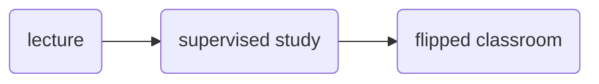
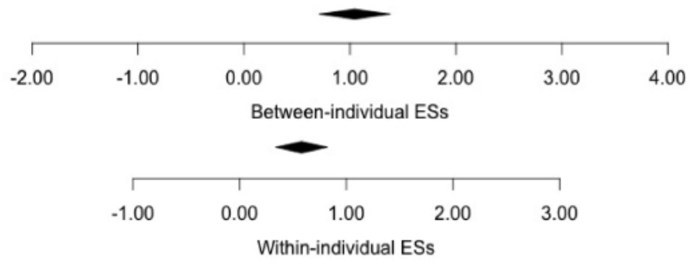
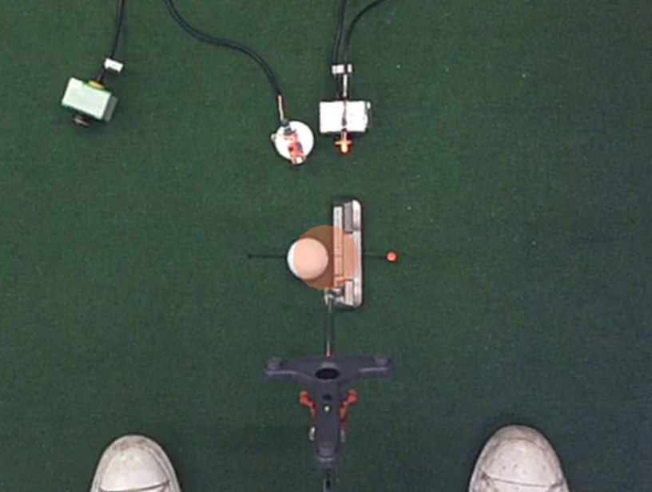

### Psychophysiology of Sport and Exercise
# Hot Topic Seminar 1: Quiet Eye
 

Germano Gallicchio

JXH-3089, Bangor University

---
layout: center
---

Attendance PIN

---
layout: two-cols
hideInToc: true
---

# Objectives 

 

Being able to:

<v-clicks>

- describe the nature of the Quiet Eye effect
- present research findings to your peers
- critically reflect on the mechanisms behind the Quiet Eye effect

</v-clicks>

::right::

# Content

 

<Toc text-sm minDepth="1" maxDepth="3" columns="2"/>

---

# Study resources

## Main

 

1. Scientific American Frontiers, Season 12, Episode 06
"On the Ball" - My Quiet Eye. https://www.youtube.com/watch?v=knfC978EoWc
<Youtube id="knfC978EoWc" width="100%" height="20%"/>

  

2. Gallicchio, G., Cooke, A., & Ring, C. (2018). Assessing ocular activity during performance of motor skills using electrooculography. _Psychophysiology, 55_(7), 1-12. https://doi.org/10.1111/psyp.13070.

 

3. Gallicchio, G., & Ring, C. (2020). The quiet eye effect: A test of the visual and postural-kinematic hypotheses. _Sport, Exercise & Performance Psychology, 9_(1), 143-159. http://dx.doi.org/10.1037/spy0000162

---
layout: two-cols-header
---

# Seminar structure
 

::left::

### Lecture
- Lecturer explains the Quiet Eye effect
  - what is the Quiet Eye
  - relation between Quiet Eye and performance
  - how is it _typically_ measured
  - how it can be measured with the EOG
- We will watch the _core_ video together and comment on it

 

::right::

### Supervised study
- Each student group will read one of the key papers associated with this seminar

 

### Flipped classroom
- Each student group will **present** the main ideas of their paper to the other group(s) and **critically reflect** on how the study contributes to understanding the mechanisms behind the phenomenon (why is QE associated with performance?)

---
layout: section
---

# Lecture
part I

---
layout: cover
---

Is there an optimal oculomotor pattern for better performance?

---
layout: two-cols-header
---

# The Quiet Eye effect

 

Performance advantage conferred by a **steady ocular fixation** on a critical target of an action

 

::left::

:: right::

### Quiet Eye is the time duration wherein:
- gaze is on a critical visual target of the action (e.g., golf ball)
- onset before movement initiation
- offset when gaze deviates from target _of a certain quantity_

---

# How is the QE _typically_ measured?
 
It requires measuring time during which the critical object lies within 3° of visual angles

 

---

# How can the EOG be used to measure the QE?

 

{width='100%'}

---
layout: section
---

# Supervised study
part II

---
layout: section
---

# Flipped classroom
part III

---