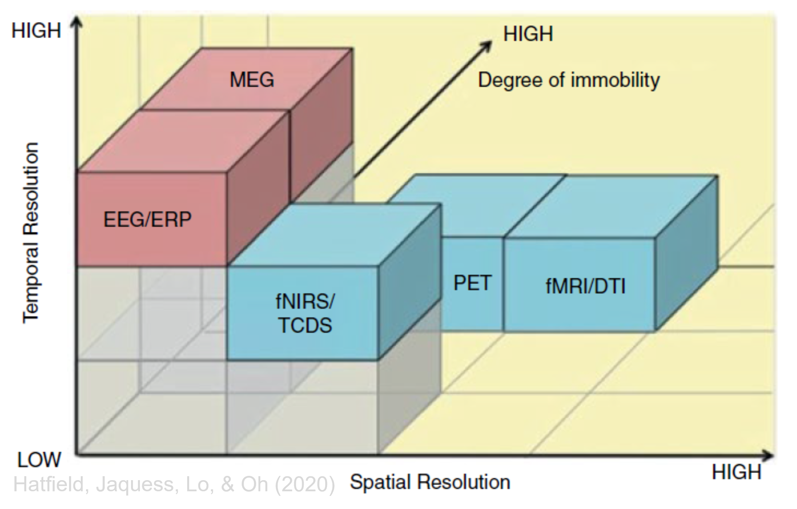

### Psychophysiology of Sport and Exercise
# Cortical psychophysiology
 

Germano Gallicchio

JXH-3089, Bangor University

---
layout: center
---

Attendance PIN

---
title: overview
hideInToc: true
---

# Overview of this submodule

| CONTENT                               | LECTURE | WORKSHOP | SEMINAR | LABS |
| ------:                               | :-----: | :------: | :-----: | :---:|
| Reminders of Anatomy and Physiology   | X       |          |         |      |
| Foundations of Electroencephalography | X       | X        |         |      |
| Hands-on experience                   |         | X        |         | X    |     
| Applications to Sport & Exercise      |         |          | X       |      |

---

# Objectives 

 

Being able to elaborate:

<v-clicks>

- biological source of the EEG signal
- metrics that can be obtained from the EEG signal

</v-clicks>

::right::

# Content
 
<Toc text-sm minDepth="1" maxDepth="3" columns="2"/>

---
layout: two-cols-header
---

# Study resources

::left::

## Main
Stern, R. M., Ray, W. J., & Quigley, K. S. (2001). Psychophysiological recording. Oxford University Press, USA.

 

Other resources (e.g., articles published in the journal _Psychophysiology_) are cited when relevant.

::right::

---

# Why study eye movements
 

Studying eye movements is useful for several purposes:

<v-clicks>

- **Research**: Studying the relationship between eye movements and cognitive processes, such as attention and memory at rest or while performing certain activities (e.g., reading, computer work, consumer behaviour)
- **Sleep**: Monitoring eye movements during different sleep stages, particularly REM sleep.
- **Human-computer interface**: Developing eye-tracking systems for controlling computers and other devices (e.g., wheelchair, speller).
- **Fatigue and sleepiness monitoring**: In fields like transportation or aviation, EOG can help monitor alertness by detecting patterns associated with drowsiness.
- **Sport**: Analyzing athletes' eye movements to improve performance and training techniques.

</v-clicks>

--- 
layout: two-cols-header
---

# Anatomical directions and planes

::left::

(Some) Anatomical directions:

- **Anterior** (or rostral) 
 
towards the front (literally: towards the face)

- **Posterior** (or caudal)
 
towards the back (literally: towards the tail)

- **superior** (or dorsal)
 
upwards 

- **inferior** (or ventral)
 
downwards

::right::

---
layout: two-cols-header
---

# Anatomical directions and planes

 

::left::

- **Lateral** 
 
towards the side

- **Medial** 
 
towards the midline

- **ipsi**lateral
 
same side

- **contra**lateral
 
opposite side

- **Proximal**
 
closer to the point of attachment or origin

- **Distal**
 
further from the point of attachment or origin

::right::

Anatomical planes (useful to image them as slices): 
- **sagittal**
 
It divides the brain into left and right

- **coronal** (or frontal)
 
it divides the brain into anterior (rostral) and posterior (caudal)

- **horizontal** (or transverse)
 
it divides the brain into superior (dorsal) and inferior (ventral)

---
layout: two-cols-header
---

# The nervous system

::left::

::right::

---
layout: two-cols-header
---

# The brain

::left::

::right::

https://www.brainfacts.org/3d-brain#intro=false&focus=Brain

---
layout: two-cols-header
---

# Cerebral cortex
The focus in this submodule

---

# Cortical Lobes

---

# Cortical Lobes

---

# Cortical Lobes

---
layout: two-cols-header
---

# Cortical layers

::left::

The cerebral cortex is divided into six layers, each with distinct types of neurons and connections.
- Layer I: Contains mostly dendrites and axons.
- Layer II: Contains small pyramidal neurons.
- Layer III: Contains medium-sized pyramidal neurons.
- Layer IV: Contains various types of neurons.
- Layer V: Contains large pyramidal neurons, including Betz cells.
- Layer VI: Contains spindle-shaped neurons.

::right::

---
layout: two-cols-header
---

# Broadmann areas

 

The concept of cytoarchitecture links the cortical layers and Broadmann areas. Cytoarchitecture studies the cellular composition of the cortex, which varies across different regions. These 

not onlu variations in cellular composition (cytoarchitecture) define the six cortical layers and
but also help identify different areas (i.e., **Broadmann** areas), each with distinct cellular structures and functions.

::left::

- Area 1, 2, 3: Primary somatosensory cortex.
- Area 4: Primary motor cortex.
- Area 17: Primary visual cortex.
- Area 22: Part of the superior temporal gyrus, involved in auditory processing.
- Area 44, 45: Broca's area, involved in language production.

::right::

---

# Cortex mapping
There are several examples of "mapping" (e.g., retinotopic, tonotopic, somatotopic)

**Somatotopic** mapping: organization of the primary somatosensory cortex (S1) and primary motor cortex (M1) where different parts of the body are represented in specific cortical areas. This is often illustrated by the sensory and motor _homunculus_, which shows the disproportionate representation of body parts based on their sensory and motor importance.

---

# Neurons

---

# Neurons

---
layout: two-cols-header
---

# Neuronal communication
electrochemical communication

 
<Youtube id="6qS83wD29PY" width="100%" height="30%"/>

https://youtu.be/6qS83wD29PY?t=8

::left::

**Action potential**:
- Fast voltage spike (1 ms)
- Travelling along the axon, from its beginning to its terminal
- Neurotransmitters are released
- Unlikely to be detected with surface electrodes

::right::

**Postsynaptic potential**:
- Slower voltage (up to hundreds of ms)
- increase (excitatory) or decrease (inhibitory)
- Travelling on the membrane of dendrites or soma
- Multiple potentials summate

---
layout: two-cols-header
---

# Dipoles

::left::

- Electrochemical activity in the dendrites generates electric fields.
- These fields create dipoles due to the separation of charges.

::right::

---
layout: two-cols-header
---

# Dipoles

::left::

- Dipoles can be detected from the scalp as voltage differences.
- The _orientation_ and magnitude of dipoles influence the signal on the scalp
- Simultaneous dipoles _summate_
- The myriad of dipoles active at the same time contributes to the overall voltage pattern on the scalp.

::right::

---
layout: two-cols-header
---

# Dipoles

::left::

- **Radial dipoles**: Oriented _perpendicular_ to the cortical surface, often generated by pyramidal neurons in the gyri. These dipoles are _more likely_ to be detected from electrodes on the scalp because their orientation aligns with the electrodes on the scalp.

- **Tangential dipoles**: Oriented _parallel_ to the cortical surface, often found in the walls of the sulci. These dipoles are _less likely_ to be detected by electrodes on the scalp as their orientation does not align well with the scalp.

Both types of dipoles contribute to the overall EEG signal, but radial dipoles generally have a stronger influence due to their alignment with the scalp surface.

::right::

---
layout: two-cols-header
---

# Electroencephalography (EEG)

::left::

| MORPHEME  | MEANING |
|---------: |:----------|
| Electro   | = electrical activity |
| encephalo | = of the brain (cortex) |
| graph    | = measurement |

::right::

---
layout: two-cols-header
---

# Characteristics of the EEG

::left::
- noninvasive
- portable
- postsynaptic potential
- high temporal resolution
- cerebral cortex
- poor spatial resolution
- objective

::right::

---

# Main parameters of waveforms

- **Frequency**: The number of cycles the waveform completes in a given time period, usually measured in Hertz (Hz). Higher frequency indicates more cycles per second.
- **Phase**: The position of a point in time on the waveform cycle, indicating the timing of the waveform relative to a reference point. Phase differences can affect how waveforms interact with each other.
- **Amplitude**: The height of the waveform, representing the strength or intensity of the signal. Higher amplitude indicates stronger signals.

---

# Main parameters of waveforms
varying frequency

---

# Main parameters of waveforms
varying phase

---

# Main parameters of waveforms
varying amplitude

---

# Simulating EEG signal
Let's sum, time by time, three waves varying in frequency, phase, and amplitude

---

# Simulating EEG signal
Same as before but let's add noise

---
layout: two-cols-header
---

# 10-20 system
an internationally recognized method to describe the location of scalp electrodes

::left::

- Electrodes are placed at intervals of 10% or 20% of the total distance between specified skull _landmarks_.
- Common landmarks include the _nasion_ (bridge of the nose), _inion_ (bump at the back of the skull), and _preauricular points_ (just in front of the ears).
- Electrode positions are labeled with letters and numbers, where letters correspond to brain regions (e.g., F for frontal, T for temporal) and numbers indicate the hemisphere (odd numbers for the left, even numbers for the right).
- It can be expanded to include additional electrodes for higher resolution recordings, known as the 10-10 or 10-5 systems.

::right::

---
layout: two-cols-header
---

# 10-20 system

::left::

| Letter    | Region  |
|----------:|:--------|
| F         | Frontal |
| C         | Central |
| P         | Parietal|
| T         | Temporal|
| O         | Occipital|
| Fp        | Frontopolar |

::right::

| Second Letter or Digit | lateral/medial  |
|-----------:|:---------------|
| z          | = on the midline |
| odd digit  | = lateral (left) |
| even digit | = lateral (right)|
| smaller digit | = closer to the midline |
| larger digit  | = farther from the midline |

---
layout: two-cols-header
---

# 10-20 system

::left::

::right::

Some examples:

Cz = central on the midline (aka vertex)

P3 = parietal, lateral to the left

P5 = parietal, even more lateral to the left (not in the figure)

---

# Electrical reference

reminder: One electrode alone cannot measure anything. You need two electrodes to measure voltage

- **Bipolar montage**:
    - Each electrode is referenced to an adjacent electrode.
    - Measures the voltage difference between pairs of electrodes.
    - Useful for detecting localized activity.
    - Can help reduce common noise.

- **Monopolar (or referential) montage**:
    - Each electrode is referenced to a common reference electrode.
    - Measures the voltage difference between each electrode and the reference.
    - Provides a broader view of brain activity.
    - Common reference points include the mastoids, earlobes, or an average of all electrodes.

---

# EEG signals

---

# EEG signals

Recordings from multiple channels

---
layout: two-cols-header
---

# EEG signals

::left::

::right::

Recordings from the same channel, under different states of consciousness

---
layout: two-cols-header
---

# EEG artifacts

::left::

::right::

- **Eye movements**: Blinks and saccades can create large artifacts, especially in the frontal regions.
- **Muscle activity**: Tension or movements in the scalp, neck, or face muscles can introduce high-frequency noise.
- **Electrode movement**: Shifts in electrode position can cause sudden changes in the recorded signal.
- **Sweat**: Changes in skin conductance due to sweating can affect the signal, especially during long recordings.
- **Heartbeats**: The electrical activity of the heart (ECG) can sometimes be picked up by EEG electrodes, especially those near the scalp.
- **Environmental noise**: Electrical interference from nearby equipment or power lines can introduce 50/60 Hz noise into the EEG signal.

---

# Brain rhythms

Spectral decomposition in EEG involves breaking down the complex EEG signal into its constituent frequency components. This process helps in identifying and analyzing the different brain rhythms and their contributions to the overall signal, providing insights into various cognitive and physiological states.

---

- **Alpha waves (8-12 Hz)**: 
    - Predominantly seen in relaxed, awake states with eyes closed.
    - Associated with calmness, relaxation, and meditation.
    - Absent during sleep or when the eyes are open.
    - More prominent in the occipital region.
- **Beta waves (12-30 Hz)**:
    - Associated with alertness, concentration, and active thinking.
    - More prominent in the frontal region.
    - Can be increased by stress, anxiety, or mental effort.
- **Delta waves (0.5-4 Hz)**:
    - Predominantly seen during deep sleep.
    - Associated with restorative processes, growth, and healing.
    - More prominent in the frontal region.
- **Theta waves (4-8 Hz)**:
    - Predominantly seen in light sleep, drowsiness, or deep relaxation.
    - Associated with creativity, intuition, and meditation.
    - More prominent in the temporal and frontal regions.

- **Gamma waves (30-100 Hz)**:
    - Associated with high-level cognitive functions, memory, and perception.
    - More prominent in the frontal and parietal regions.
- **Mu waves (8-13 Hz)**:
    - Similar to alpha waves but more localized to the sensorimotor cortex.
    - Associated with motor planning, execution

---
layout: two-cols-header
---

# Topographical mapping

::left::

::right::

- Visual representation of EEG data across the scalp.
- Helps identify spatial patterns of brain activity.
- Useful for detecting regional differences in brain function.
- Often used in clinical and research settings to analyze brain waves.
- Provides a comprehensive view of brain dynamics over time.

---

# Uses of EEG in sport and exercise

----